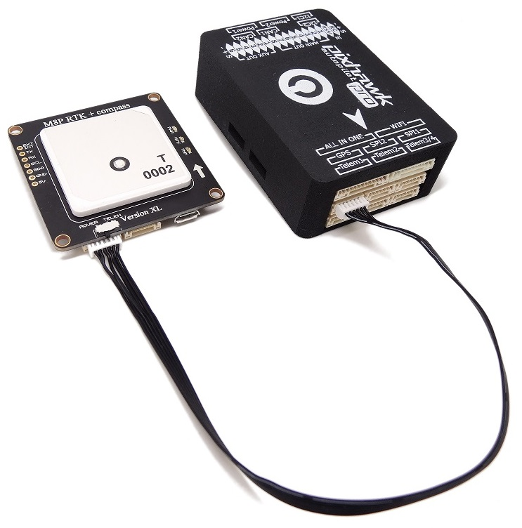
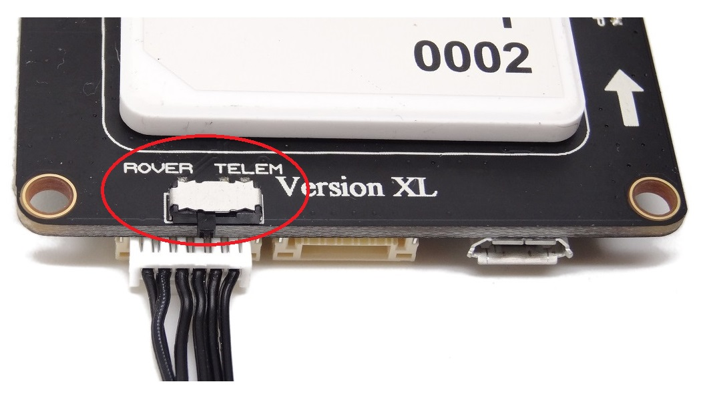
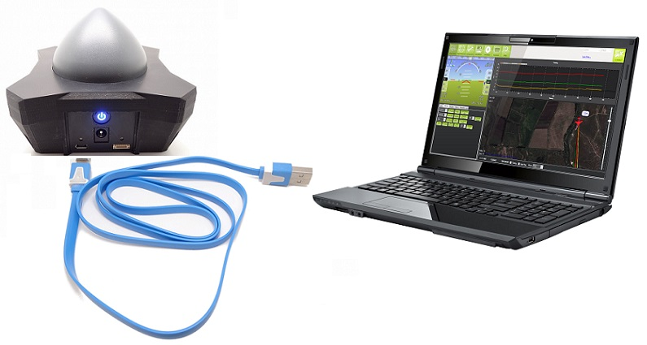
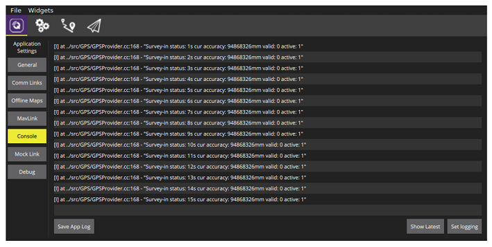
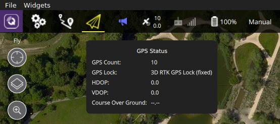

# RTK GPS

To understand how works the RTK, I advise you to visit [this page](https://drotek.com/en/documentation/tiny-rtk-documentation/#quest-ce-que-le-rtk-2).

### HARDWARE

You will need:

* A pair of u-blox M8P GPS devices ([base + rover](https://drotek.com/shop/en/home/843-rtk-gps-kit-for-pixhawk.html))
* A laptop/PC with QGroundControl 
* A Telemetry or WiFi between the autpilot and the laptop 

The rover module must be securely attached to the unit, preferably in the same direction as your Pixhawk and raised a few centimeters above your motors.
Connect the JST-GH cable on the `Serial1` connector of your Pixhawk and the Rover connector of the RTK module.

> **Note** Don't forget to place the switch on the rover position. 

Then, connect the laptop to the base RTK module with a micro USB cable. 

The base GPS device needs to be in a fixed position while it is used. So make sure it is in a position where it is not moved and with a clear view to the sky, not close to a building. Preferably, it should be elevated (for example with a tripod, or on a roof). Compared to normal GPS, RTK is more sensitive and needs a careful setup.

### SOFTWARE \(PX4 / QGC\)

Before proceeding with the configuration, make sure that your rover module is correctly positioned as described in the previous section.

> **Note** Configure the rover and base module in following [this page](https://drotek.com/en/lessons/comment-utiliser-le-module-rtk-drotek/).

To configure this module with QgroundControl, go to the `Sensor` configuration window under `Compass`:

In the window above, select `Rotation_None`.

Then calibrate the compass by successively performing the rotations indicated by the images with your camera.

If you started QGroundControl via console, you should see the status update there as well (if not, make sure the autoconnect to RTK GPS option is checked in the general application settings).

What you see is the status of the survey-in process. This is a startup procedure to get an accurate position estimate of the base station. It's configured to run at least 3 minutes and it must reach an accuracy of 1 meter. The current accuracy is printed to the console. It takes several minutes to complete, depending on the GPS signal reception.

While survey-in is running you can already start the vehicle and make sure it connects to QGroundControl. No further setup on the vehicle is required. Once the survey-in process is finished, QGroundControl automatically starts to send the RTCM correction data to the vehicle. After a while it should switch to RTK mode, which is visible in the GPS status (3D RTK GPS Lock):

There are two RTK modes: Float and Fixed. While the Float mode is easier to reach, it is a bit less accurate than Fixed mode (further explanations are for example here). The system will automatically switch to Fixed mode when the signal is good enough.

Now you can start to fly!

You may also need to tune some parameters. The default parameters are tuned assuming a GPS accuracy in the order of meters, not centimeters.

