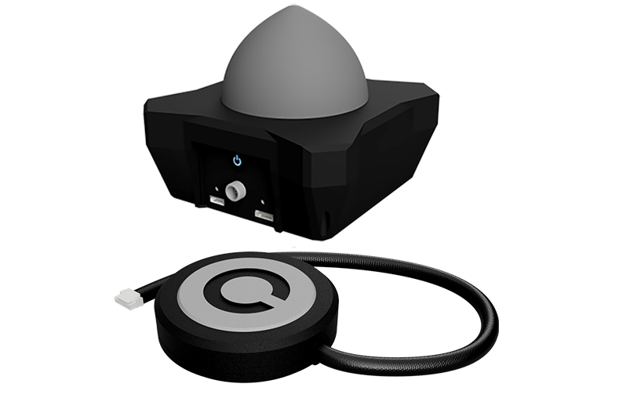
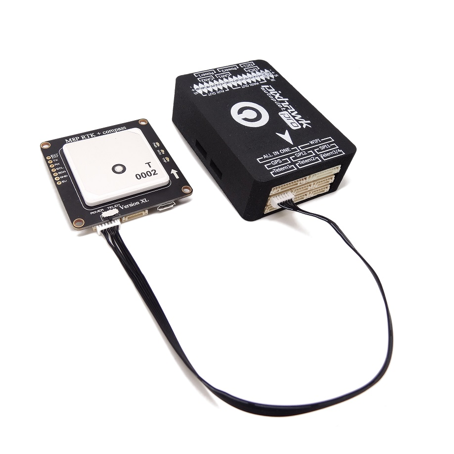
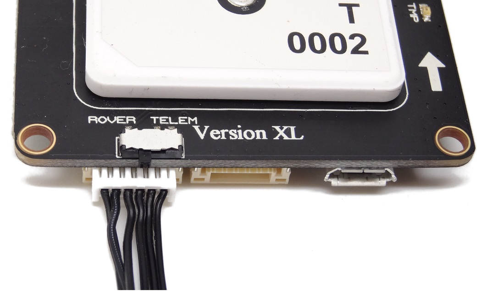
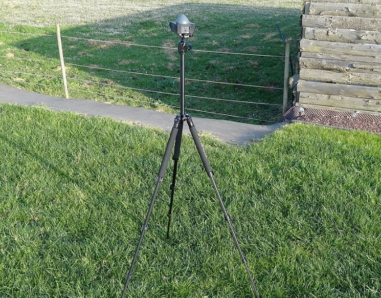

# RTK GPS

To understand how works the RTK, I advise you to visit [this page](https://drotek.com/en/documentation/tiny-rtk-documentation/#quest-ce-que-le-rtk-2).

### HARDWARE

You will need:

* A pair of u-blox M8P GPS devices ([base + rover](https://drotek.com/shop/en/home/843-rtk-gps-kit-for-pixhawk.html))
* A laptop/PC with QGroundControl 
* A Telemetry or WiFi between the autpilot and the laptop 

The rover module must be securely attached to the unit, preferably in the same direction as your Pixhawk 3 Pro and raised a few centimeters above your motors.
Connect the JST-GH cable on the `Serial1` connector of your Pixhawk and the Rover connector of the RTK module.

Don't forget to configure the switch on `rover` position. 

Then, connect the laptop to the base RTK module with a micro USB cable. 

The base GPS device needs to be in a fixed position while it is used. So make sure it is in a position where it is not moved and with a clear view to the sky, not close to a building. Preferably, it should be elevated (for example with a tripod, or on a roof). Compared to normal GPS, RTK is more sensitive and needs a careful setup.

### SOFTWARE \(PX4 / QGC\)

Before proceeding with the configuration, make sure that your rover module is correctly positioned as described in the previous section.

To configure this module with QgroundControl, go to the `Sensor` configuration window under `Compass`:

In the window above, select `Rotation_None`.

Then calibrate the compass by successively performing the rotations indicated by the images with your camera.

