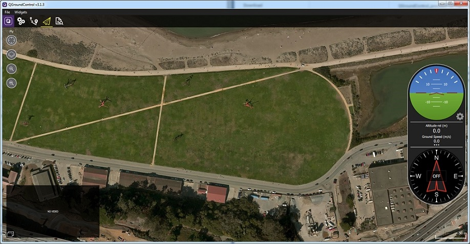

# QGroundControl 

QGroundControl\_provides full flight control and vehicle setup for PX4 or ArduPilot powered vehicles. It provides easy and straightforward usage for beginners, while still delivering high end feature support for experienced users.

**Key Features:**

* Full setup/configuration of ArduPilot and PX4 Pro powered vehicles.
* Flight support for vehicles running PX4 and ArduPilot \(or any other autopilot that communicates using the MAVLink protocol\).
* Mission planning for autonomous flight.
* Flight map display showing vehicle position, flight track, waypoints and vehicle instruments.
* Video streaming with instrument display overlays.
* Support for managing multiple vehicles.
* QGC runs on Windows, OS X, Linux platforms, iOS and Android devices.

