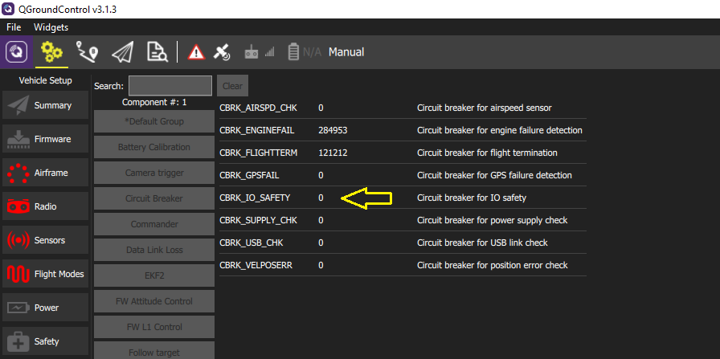

# Safety switch

The Pixhawk is sold without the switch safety. To arm your autopilot without it, you must activate the `Circuit breaker` function in QGroundControl. Setting this parameter to `22027` will disable IO safety. 

> **WARNING**: ENABLING THIS CIRCUIT BREAKER IS AT OWN RISK. THE OTHER SOLUTION IS TO CONNECT YOUR OWN SAFETY SWITCH ON THE **ALLINONE** PORT OF YOUR PIXHAWK.

