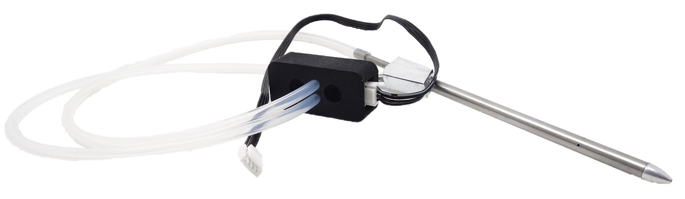
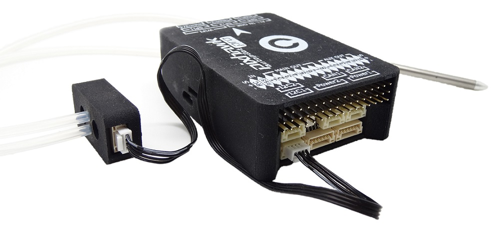

# sdp33

La**Pixhawk 3 Pro** supporte l’utilisation d’un capteur de vitesse, ce qui peut aider dans des conditions venteuses, vol lent et pendant des atterrissages autonomes avec un drone à voilure fixe.

Ce capteur de pression différentielle numérique a un très faible décalage, une haute résolution et ne souffre pas du bruit induit par de longs câbles.

Le capteur **SDP3X** de Sensirion a une excellente précision et une répétabilité \(même inférieure à 1Pa\), pas de décalage de zéro \(pas de dérive\) et calibré et compensé par la température.

## HARDWARE

Connectez le capteur au port I2C de la Pixhawk. La photo ci-dessous illustre la connexion entre la Pixhawk et le capteur de vitesse:

Placez la sonde **Pitot** comme illustré sur la photo. Assurez-vous que les trous sur le côté du tube ne soient pas couverts. Ils devraient être décalés d’au moins **1 centimètre** par rapport au fuselage. Reliez les deux tubes de caoutchouc qui sortent à l’arrière de la sonde au capteur de vitesse. Connectez la partie la plus longue du tube de Pitot au cône du dessus du capteur de vitesse. Faire de même avec la partie la plus courte du tube au cône du bas.

Si vous utilisez un avion avec une hélice placée à l’avant, le tube Pitot doit être monté sur une aile pour être en dehors du flux de l’hélice.

## SOFTWARE \(PX4 with QGC\)

Aucune configuration n’est nécessaire sous **QgroundControl** pour l’utilisation de ce capteur.

Pour afficher dans **QgroundControl** la valeur lue par le capteur cliquez sur : 

Le widget présent sur la droite permet de visualiser les données issues des différents capteurs embarqués sur votre **Pixhawk 3 Pro**.

Pour afficher les données qui vous intéressent cliquez sur: 

Cochez le paramètre « Air Speed ». Vous pouvez choisir la taille de l’affichage en cochant « Large ».

Validez en cliquant sur « OK ».

