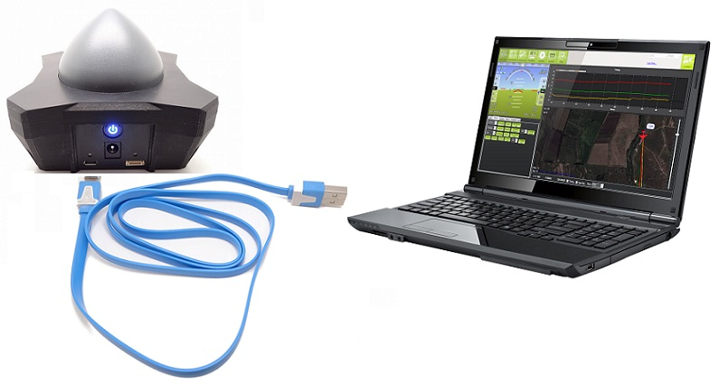
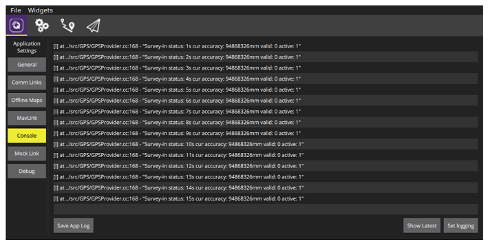

# GPS RTK

Vous pourrez trouver toutes les informations sur le fonctionnement et l'utilisation des modules RTK Drotek en suivant [ce lien](https://www.gitbook.com/book/drotek/doc-rtk/details).

### HARDWARE

Munissez vous de:

* une paire de GPS u-blox M8P 
* un ordinateur avec QGroundControl 
* une télémétrie ou un système WiFi entre l'autpilote et l'ordinateur 

Le GPS rover doit être solidement attaché à l'unité, de préférence dans la même direction que votre Pixhawk et surélevé quelques centimètres au-dessus de vos moteurs.  
Connectez le câble JST-GH sur le connecteur `GPS` de votre Pixhawk et branchez le au connecteur Rover du module RTK.

> **Note** N'oubliez pas de placer le switch sur la position rover.

Ensuite, connecter l'ordinateur à la base RTK avec un câble micro USB.

La base RTK doit être dans une position fixe pendant qu'il est utilisé. Alors assurez-vous qu'elle est dans une position où elle n'est pas déplacée et avec une vue dégagée sur le ciel, pas près d'un bâtiment. De préférence, elle devrait être élevée \(par exemple avec un trépied ou sur un toit\). Par rapport au GPS normal, le système RTK est plus sensible et nécessite une mise en place attentive.

### SOFTWARE \(PX4 / QGC\)

Avant de procéder à la configuration, assurez-vous d’avoir bien placé votre module comme indiqué dans la section précédente.

> **Note** Configure the rover and base module in following [this page](https://drotek.com/en/lessons/comment-utiliser-le-module-rtk-drotek/).

Pour configurer votre module GPS mushroom avec QgroundControl, accédez à la fenêtre de configuration `Sensors` rubrique `Compass` :

Dans la fenêtre ci-dessus, sélectionnez `Rotation_None`.

Procédez ensuite à la calibration du compas en effectuant successivement avec votre appareil les rotations indiquées par les images.

Si vous avez lancé QGroundControl via la console, vous devriez également voir l'état de la mise à jour \(sinon, assurez-vous que l'option autoconnect to RTK GPS est cochée dans les paramètres généraux de l'application\).

Ce que vous voyez, c'est le statut du mode survey-in. Il s'agit d'une procédure de démarrage pour obtenir une estimation de position précise de la station de base. Il est configuré pour fonctionner au moins 3 minutes et doit atteindre une précision de 1 mètre. La précision actuelle est affichée sur la console. Il faut plusieurs minutes, selon la réception du signal GPS.  
Alors que le mode survey-in est en cours d'exécution, vous pouvez déjà démarrer le véhicule et assurez-vous qu'il se connecte à QGroundControl. Aucune autre configuration sur le véhicule n'est nécessaire. Une fois le survey-in terminé, QGroundControl commence automatiquement à envoyer les données de correction RTCM au véhicule. Après un certain temps, il doit passer en mode RTK, visible dans l'état du GPS \(3D RTK GPS Lock\):

Il existe deux modes RTK: Float et Fixed. Bien que le mode Float soit plus facile à atteindre, il est un peu moins précis que le mode fixe. Le système passe automatiquement en mode fixe lorsque le signal est assez bon.  
Maintenant, vous pouvez commencer à voler!  
Vous devrez peut-être également régler certains paramètres. Les paramètres par défaut sont réglés en supposant une précision GPS de l'ordre du mêtre, pas des centimètres.

