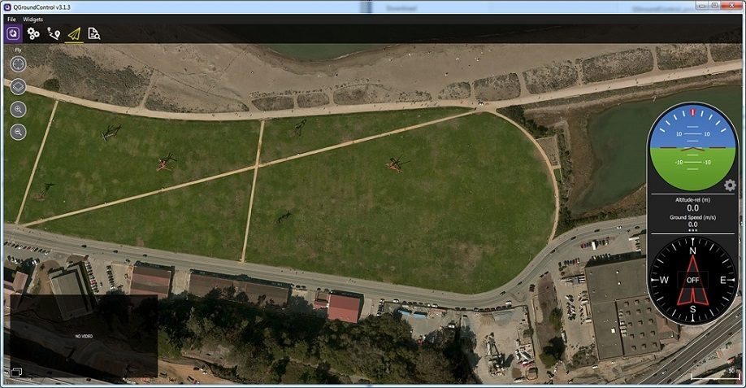

# QGroundControl 

QGroundControl\_provides full flight control and vehicle setup for PX4 or ArduPilot powered vehicles. It provides easy and straightforward usage for beginners, while still delivering high end feature support for experienced users.

QGroundControl\_provides le contrôle complet du vol et la configuration du véhicule pour les véhicules à moteur PX4 ou ArduPilot. Il offre une utilisation facile et directe pour les débutants, tout en offrant un support de fonctionnalité haut de gamme pour les utilisateurs expérimentés.

Principales caractéristiques:

Configuration complète / configuration des véhicules alimentés par ArduPilot et PX4 Pro.
Support de vol pour les véhicules qui exécutent PX4 et ArduPilot (ou tout autre pilote automatique qui communique en utilisant le protocole MAVLink).
Planification de la mission pour le vol autonome.
Affichage de la carte de vol montrant la position du véhicule, la piste de vol, les waypoints et les instruments du véhicule.
Vidéo en streaming avec des superpositions d'affichage d'instrument.
Prise en charge de la gestion de plusieurs véhicules.
QGC s'exécute sur Windows, OS X, plates-formes Linux, iOS et appareils Android.

**Key Features:**

* Full setup/configuration of ArduPilot and PX4 Pro powered vehicles.
* Flight support for vehicles running PX4 and ArduPilot \(or any other autopilot that communicates using the MAVLink protocol\).
* Mission planning for autonomous flight.
* Flight map display showing vehicle position, flight track, waypoints and vehicle instruments.
* Video streaming with instrument display overlays.
* Support for managing multiple vehicles.
* QGC runs on Windows, OS X, Linux platforms, iOS and Android devices.

