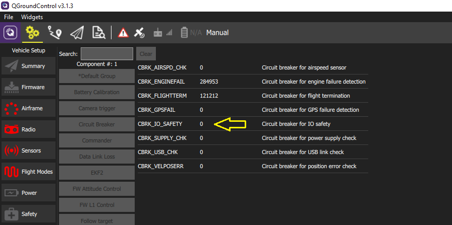

# safety switch

La Pixhawk est vendue sans le bouton de sécurité. Pour armer votre autopilote sans ce dernier, vous devez activer la fonction `Circuit Breaker` dans QGroundControl. Le réglage de ce paramètre sur `22027` désactivera la fonctionnalité.

> **WARNING**: L'ACTIVATION DE CE DISJONCTEUR EST À VOTRE PROPRE RISQUE. L'AUTRE SOLUTION EST DE CONNECTER VOTRE PROPRE INTERRUPTEUR DE SÉCURITÉ SUR LE PORT **ALLINONE** DE VOTRE PIXHAWK.

