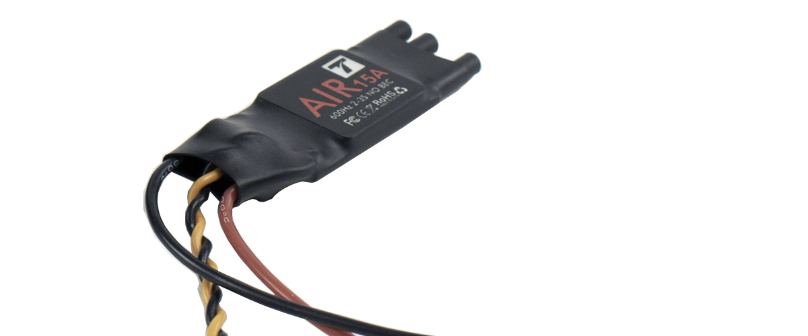
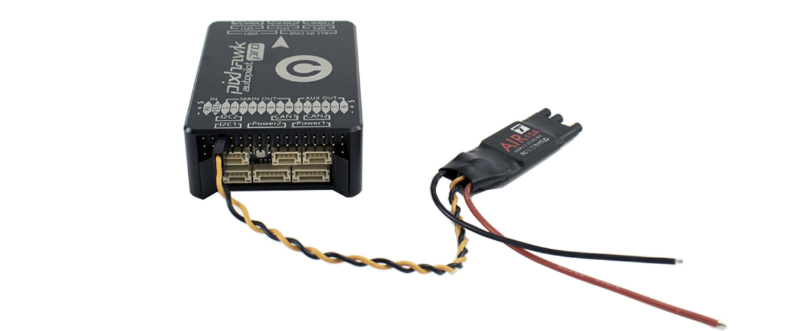

# esc-motor

The **ESC** \(Electronic Speed Controller\) allows the speed control of the motors according to the orders of the flight controller. Typically the control signal used by the ESCs is a PWM \(Pulse Width Modulation\) but some models allow the use of **I2C** or **CAN** signals.

The Pixhawk 3 Pro has **8 PWM outputs** for 8 ESC / Motor pairs.

[Get more information and shop here.](https://store.drotek.com/air-esc-15a-opto-t-motor)

## HARDWARE

Please connect each of your PWM ESCs to the corresponding "**Main Out**" output. Refer to the diagram below for the order of your ESC / Motor.

All blue motors should only be used with CCW propellers. Green motors with CW propellers.

To see what a CCW propeller looks like, please see the previous picture.

Also check the direction of the motors.

> **For safety reasons, remove the propellers before handling!**

To reverse the direction of a motor, simply swap two of the three cables that link the motor to the ESC.

