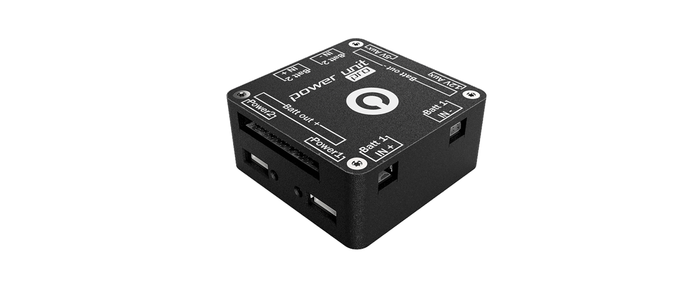

# pmu

Along with the numerous drone parts Drotek is selling, Drotek has developed a couple of boards related to the power management operation inside of embedded electronics in general. At the end of this year 2017, Drotek created [a new power management unit](https://store.drotek.com/pixhawk-3-pro/890-power-management-unit-pro-8944595120663.html), built to provide a solid and reliable power supply for as many projects as possible.

Designed to perform with drones, it is plug-and-play with the Pixhawk 3 PRO autopilot that Drotek released the same year.

You will find more information on this [page](https://drotek.gitbooks.io/power-management-unit-user-guide/).

## SOFTWARE

To configure your Tiny module under QgroundControl, go to the "Power" configuration window.

* Number of Cells \(in Series\): enter here the number of cells in your lipo battery, this parameter is indicated on your battery by the words 3S, 4S ......
* Full Voltage \(per cell\): leave this parameter by default `4.05`
* Empty Voltage \(per cell\): leave this parameter by default `3.40`
* Voltage divider: `15.9`
* Amps per volt: `37.51`

