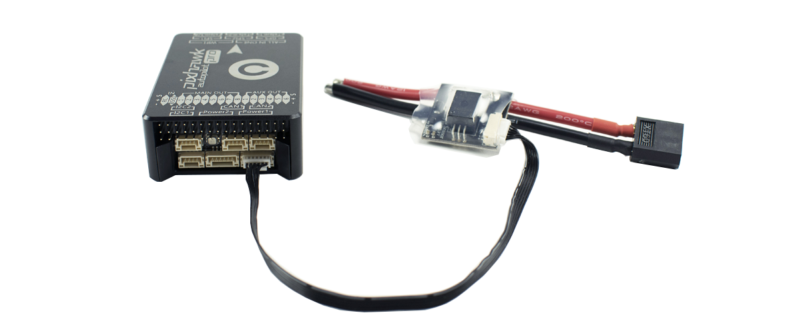

# tiny-module

This module is used to power the **Pixhawk 3 Pro** autopilot with a stabilized voltage.

It is also able to measure the overall consumption of your system using its **Hall effect** sensor. It is able to safely charge up to 200A \(according to version\).

The module is equipped with a **LED** indicator to warn you if there is a power problem.

You will find more information on [this page](https://store.drotek.com/power-supply/806-612-voltage-current-power-supply.html#/133-dropix_option-100a).

## HARDWARE

Please connect the power module to the "**Power 1**" port on the Pixhawk.

For redundancy, it is possible to use a second module with another battery, all connected to the port "**Power 2**" of the Pixhawk.

In this case, the autopilot uses only the first module for its own power supply. On the other hand, if the first module were to be broken, the autopilot switches directly to the second one.

## SOFTWARE

To configure your Tiny module under QgroundControl, go to the "Power" configuration window.

* Number of Cells \(in Series\): enter here the number of cells in your lipo battery, this parameter is indicated on your battery by the words 3S, 4S ......
* Full Voltage \(per cell\): leave this parameter by default `4.05`
* Empty Voltage \(per cell\): leave this parameter by default `3.40`
* Voltage divider: `7.65`
* Amps per volt: `37.4`

