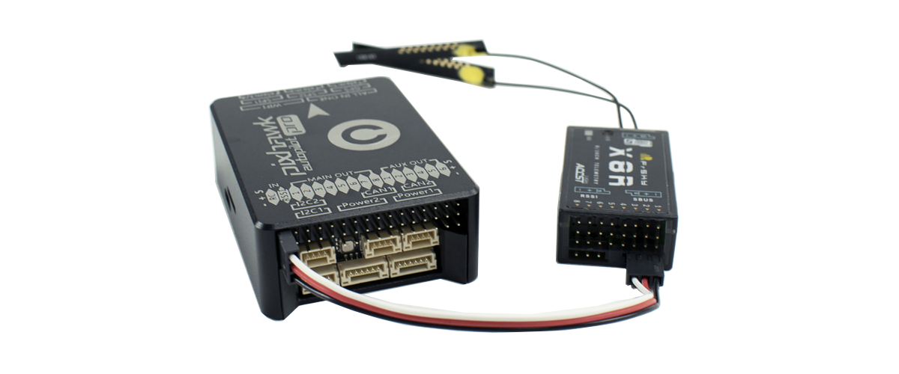

# radio-receiver

There are 3 different ways to connect your receiver to the Pixhawk, depending on your hardware.

**SBUS** or **PPM receiver**: If you have a SBUS or PPM receiver, as "[X8R](https://store.drotek.com/communication/400-receiver-x8r-frsky.html)" or "[D4R-II](https://store.drotek.com/communication/503-d4r-ii-receiver-4-channels-accst-fr-sky.html)" from FrSky, you must plug it on the RC input of the Pixhawk.

**Classic Receiver**: If you have a conventional receiver you must go through a [PPM encoder](https://store.drotek.com/communication/503-d4r-ii-receiver-4-channels-accst-fr-sky.html) \(up to 8 CHANNELS\) and connect it to **RC** of the Pixhawk. Remember to activate the solder bridge on the encoder if you want to power your receiver from the Pixhawk.

